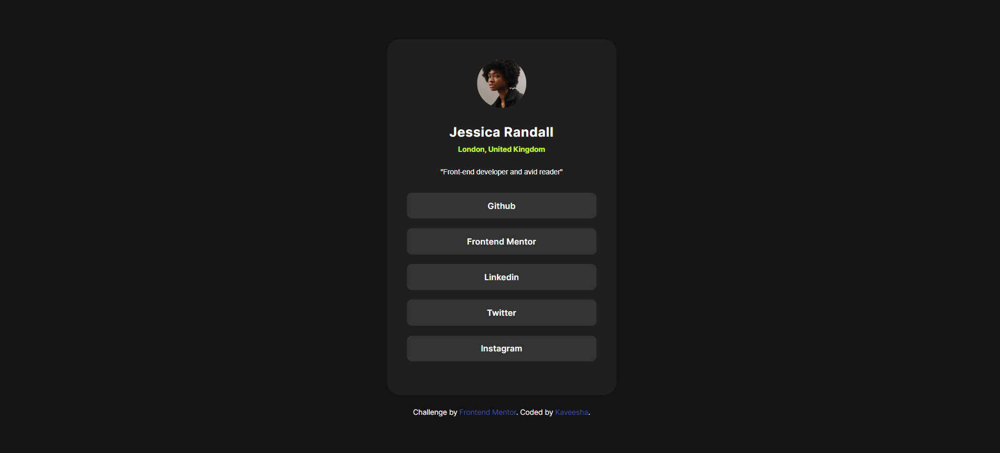

# Frontend Mentor - Social links profile solution

This is a solution to the [Social links profile challenge on Frontend Mentor](https://www.frontendmentor.io/challenges/social-links-profile-UG32l9m6dQ). Frontend Mentor challenges help you improve your coding skills by building realistic projects.

## Table of contents

- [Overview](#overview)
  - [The challenge](#the-challenge)
  - [Screenshot](#screenshot)
  - [Links](#links)
- [My process](#my-process)
  - [Built with](#built-with)
  - [What I learned](#what-i-learned)
  - [Continued development](#continued-development)
  - [Useful resources](#useful-resources)
- [Author](#author)
- [Acknowledgments](#acknowledgments)

**Note: Delete this note and update the table of contents based on what sections you keep.**

## Overview

### The challenge

Users should be able to:

- See hover and focus states for all interactive elements on the page

### Screenshot



### Links

- Solution URL: [Add solution URL here](https://github.com/kaveeshagim/social-links-profile-card.git)
- Live Site URL: [Add live site URL here](https://kaveeshagim.github.io/social-links-profile-card/)

## My process

### Built with

- HTML5
- CSS custom properties
- Flexbox
- Mobile-first workflow

### What I learned

I learned how to apply the hover effect to the lists and a tags together to integrate the text color change

some css im proud of

```css
ul li {
  background: var(--Grey-700);
  margin-bottom: 15px;
  border-radius: 8px;
  cursor: pointer;
}

ul li a {
  display: block;
  text-decoration: none;
  color: var(--White);
  font-family: "Inter SemiBold", sans-serif;
  line-height: 1.5;
  font-size: 13px;
  padding: 10px 0;
  text-align: center;
}
```

### Continued development

I want to learn further about max-height and max-width css properties and experiment more with them to get a clearer understanding. For future enahncements of this challenge, i want to try to build a set of profile cards with interactive features

## Author

- Github - [https://github.com/kaveeshagim](https://github.com/kaveeshagim)
- Frontend Mentor - [@kaveeshagim](https://www.frontendmentor.io/profile/kaveeshagim)
- Instagram - [@codingwcn](https://www.instagram.com/codingwcn)
